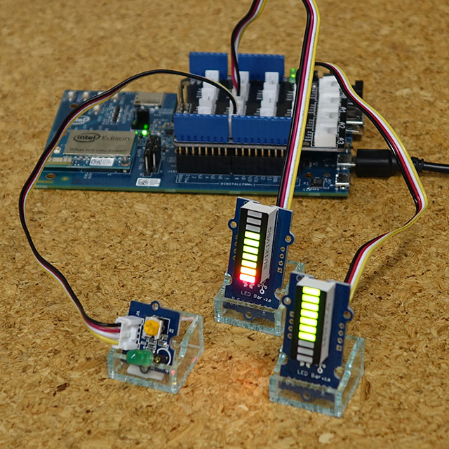

# Songle Sync Intel Edison向けslaveプロジェクト

Intel Edison Kit for Arduino + Grove Shieldに接続されたLED Barが伯に合わせて上下し、LEDも拍に合わせて明滅します。



## 必要なハードウェア

- [Intel Edison Kit for Arduino](https://www.switch-science.com/catalog/1958/)
- [Grove Shield](https://www.switch-science.com/catalog/1293/)
- [Grove LED Barモジュール](https://www.switch-science.com/catalog/2511/) ×2 (Grove Shield D6, D8ピンに挿します)
- [Grove LEDモジュール](http://wiki.seeed.cc/Grove-LED_Socket_Kit/) (拍に合わせて明滅します; Grove Shield D2ピンに挿します)

## 一般的な使い方説明

以下のようにして実行してください。 `npm install` は最初の一度だけ必要です。

```sh
$ npm install
$ node index.js
```

## ビルド方法の説明

`index.ts` はTypeScriptで書かれているので、 `tsc` コマンドを使ってビルドしてください。 `index.js` が上書きされます。

```sh
$ tsc
```

`tsc` がインストールされていない環境では、まず以下のようにしてインストールする必要があります。

```sh
$ npm install -g typescript
```

## 静的IPを設定する方法

`/etc/wpa_supplicant/wpa_cli-actions.sh` の接続時の処理で、DHCPクライアントを立ち上げる代わりに `ifconfig` コマンドを呼ぶようにします。 `<ip>` と `<netmask>` に設定したい値を入れてください。

```sh
if [ "$CMD" = "CONNECTED" ]; then
    kill_daemon udhcpc /var/run/udhcpc-$IFNAME.pid
#   udhcpc -i $IFNAME -p /var/run/udhcpc-$IFNAME.pid -S
    ifconfig $IFNAME <ip> netmask <netmask>
fi
```

これだけだと外向きの通信ができない場合、以下のようにデフォルトゲートウェイを設定する必要があります。 `<gateway>` にはルータなどのゲートウェイのIPアドレスを入れてください。

```sh
# route add default gw <gateway>
```
